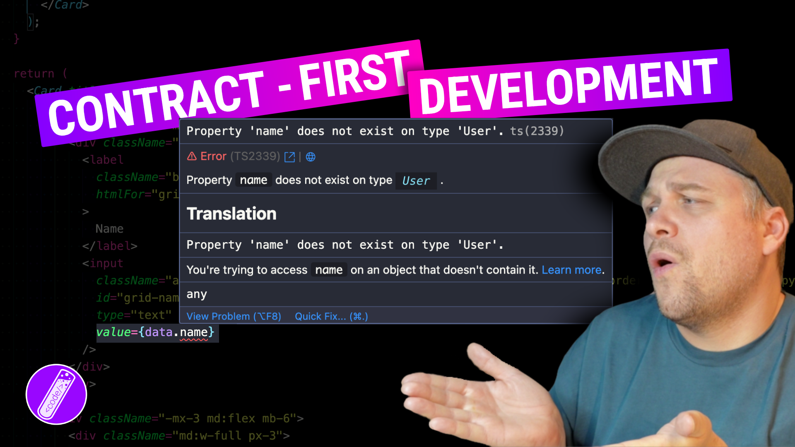
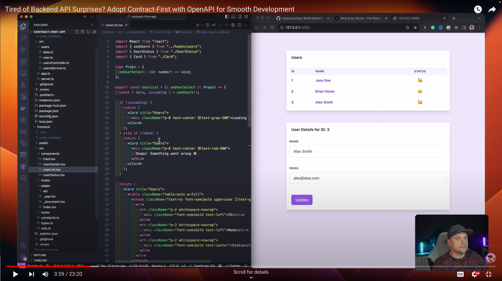

# Contract-First Development (Demo)

This repo was built during the recording of a YouTube tutorial on Contract-first development.

[](https://youtu.be/AVT0FUKcvvk)



## Stack

- Next.js
- Tsoa
- Tanstack Query
- Tailwind

## Architecture

This project has a backend (Tsoa) and a frontend (Next.js). Both need to run for the project to work. It's best to run them in separate terminals.

## Backend

### Install

```bash
cd backend
npm install
```

### Development

```bash
npm run dev
```

## Frontend

### Install

```bash
cd frontend
npm install
```

### Development

```bash
npm run dev
```

## Branches

### Branch `main`

The starting point of the tutorial.
The frontend has a copy of the data model. If the backend team decides to change the model the frontend model will be out of sync.

```bash
git checkout main
```

### Branch `feat/generated-api-client`

The end result of the tutorial.
By using an OpenAPI contract we can remove duplicate code in the frontend and stay easier up to date with changes in the backend API.

```bash
git checkout feat/generated-api-client
```

## Enjoy
